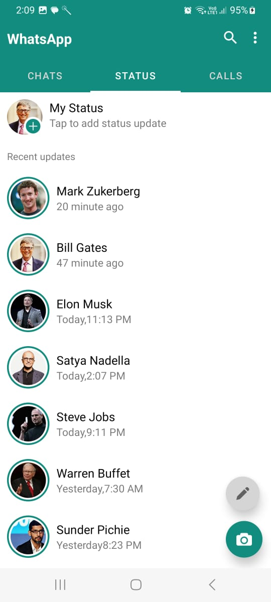
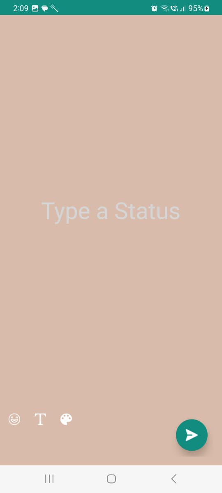
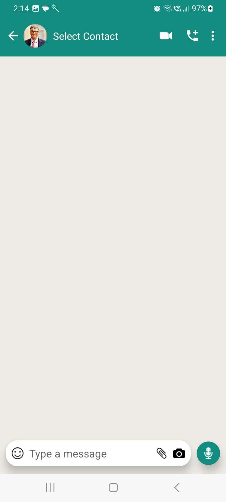
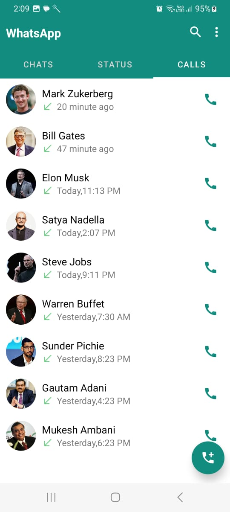
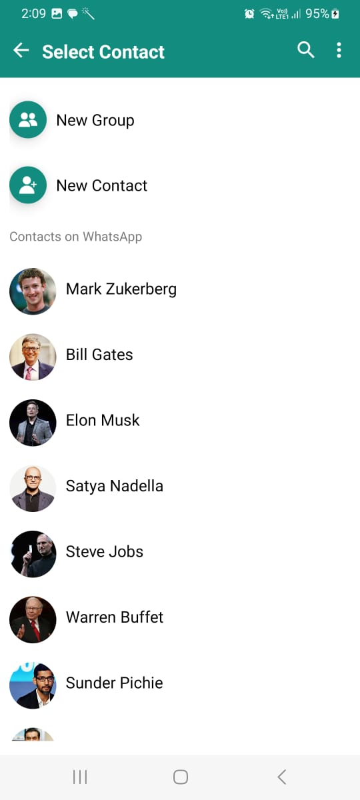

# WhatsApp Clone UI

This repository contains the user interface (UI) code for a WhatsApp Clone, offering a familiar and user-friendly messaging experience.


## Features

- **Real-time Messaging:** Mimics the functionality of WhatsApp for instant messaging.
- **Multimedia Support:** Send text messages, images, and other media files.
- **User Authentication:** Secure user authentication and authorization.
- **Responsive Design:** Ensures a consistent experience across various devices.


## Screenshots
<div align="center">
  
  
  
  
  
  
  
  
</div>


## Getting Started

### Prerequisites

- Ensure you have [Node.js](https://nodejs.org/) installed on your machine.

### Installation

1. Clone the repository:

   ```bash
   https://github.com/ShiroyaShubham/WhatsApp-Copy.git
